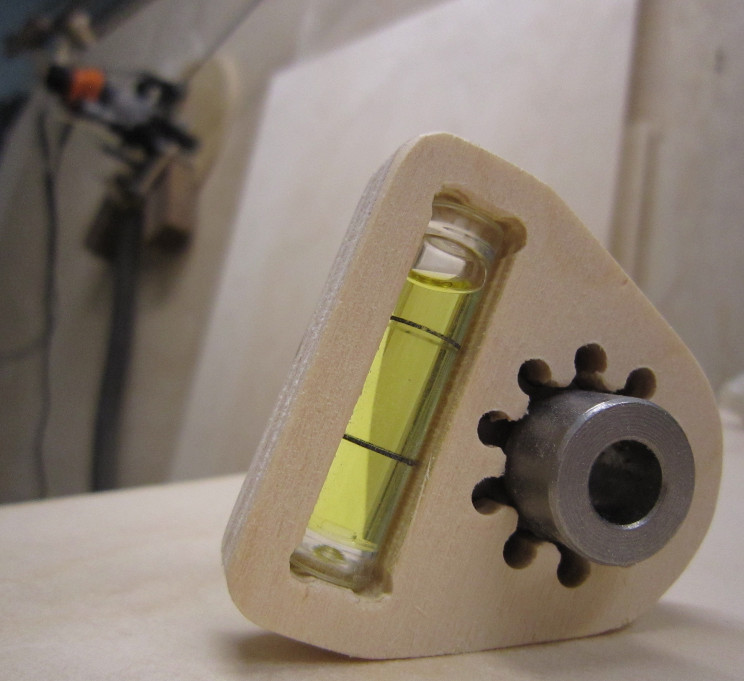

# 12OClockLevel
A template FreeCAD file to CNC your own MaslowCNC calibration 12 O'Clock level.

When calibrating your MaslowCNC, [setting sprocket 12 O'Clock](https://forums.maslowcnc.com/t/set-your-12-oclock-position-with-a-level-because/8445) vertical position is important. 

Based on [BradM's 3D printable creation](https://forums.maslowcnc.com/t/set-your-12-oclock-position-with-a-level-because/8445/2), I provide a FreeCAD template for you to CNC your own flavor. 

It is also a working FreeCAD (0.18) project you might want to [discuss about](https://forums.maslowcnc.com/c/projects)

 
